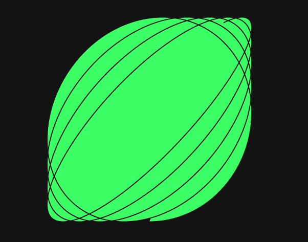
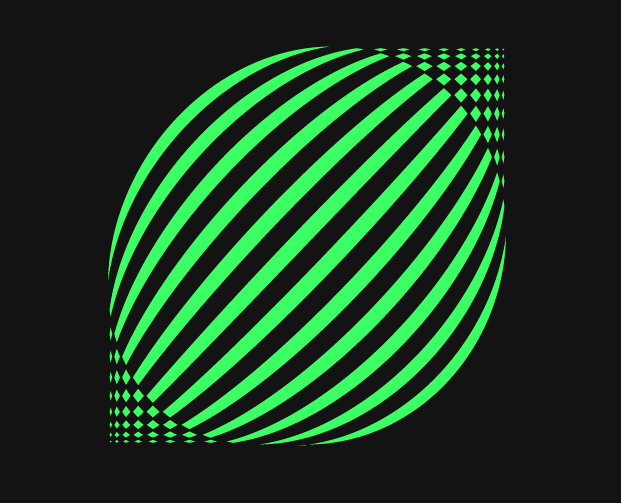
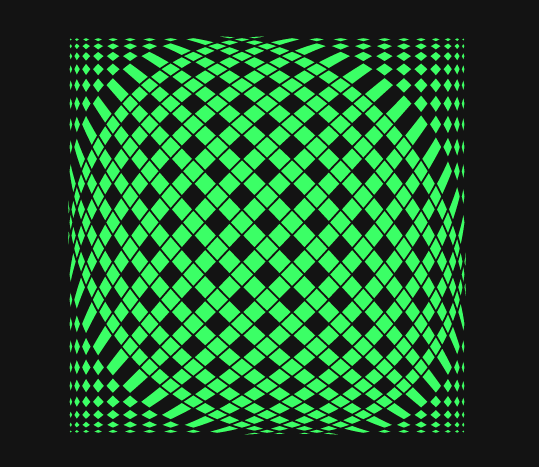
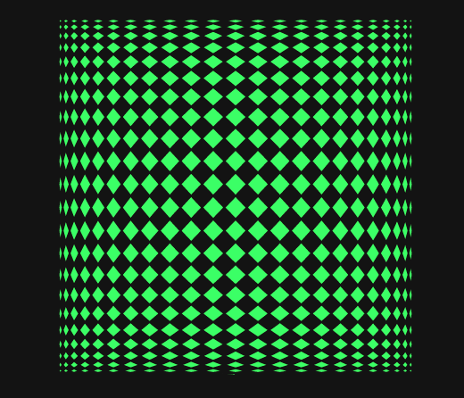

# lissajous-curves
An animated example of harmonic motion using Lissajous curves.

During my studies of p5.js through Creative Coding, I was taught how to develop harmonic motion using sin() and cos() -- powerful mathematical formulas that can be used to create realistic movement in animation. 

The shapes and patterns that are displayed while the loop draws the sketch are somewhat by design. I played with multiple parameters, variables, and colors to produce an animation that is as clean as an additive loop can possibly be. I love how aesthetically pleasing the final result came out to be.

A few screenshots of the draw loop in action: 

<3